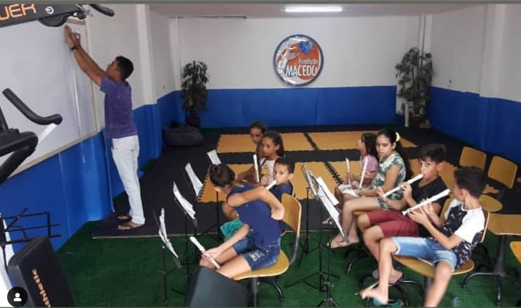
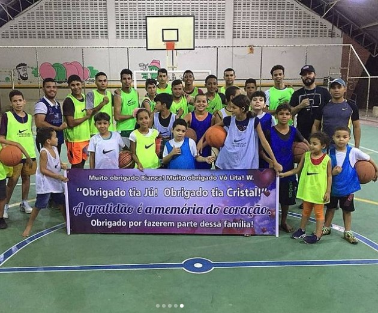

# Projeto Front-End Desenvolvido para a Fundação Macedo

  <b>"FUNDAÇÃO MACEDO - LEVEZA, ESPERANÇA E TRANSFORMAÇÃO!"</b>  
 <td> </td>
  

## Sobre a Fundação:

💪 O Início da Jornada
- A Fundação Macedo, estabelecida por Gleyson Macedo em 2014/2015, é um projeto social dedicado a proporcionar esperança e inspiração para crianças que enfrentam situações desafiadoras. Nosso compromisso é criar momentos de alegria, superação e aprendizado por meio da interação entre pessoas e animais, com destaque para nossas majestosas araras.

🧟‍♀️ Cenário da Pandemia
- A história da Fundação Macedo ganhou forma durante a pandemia, quando Gleyson percebeu a crescente tensão entre crianças confinadas, muitas delas lidando com perdas e traumas decorrentes de separações familiares. Foi nesse momento que surgiu a ideia ousada de trabalhar com araras, enxergando nelas uma presença majestosa capaz de impactar positivamente as vidas das crianças.

🦜 Uma Jornada Desafiadora
- Apesar dos obstáculos, Gleyson persistiu em sua missão de adquirir araras de forma legal para o projeto. Após mais de dois anos de esforço, o projeto recebeu um sinal divino em forma de Olívia, uma arara canindé que chegou no dia do aniversário de Gleyson em 2022.

## Tecnologias Utilizadas no Desenvolvimento: 

  
  

## Etapas de Desenvolvimento: 

- Desenvolvimento de website para a Fundação Macedo utilizando HTML, CSS e Javacript.
- HTML para a estrutura básica da página, incluindo cabeçalho, corpo e rodapé. 
- Uso do CSS para definir a aparência da página, incluindo as cores, fontes e tamanhos dos elementos. 
- E Javascript para adicionar interatividade e funcionalidade à página.
- Utilização do GitHub para a colaboração do projeto entre os desenvolvedores de forma remota. Com a criação de ramificações do projeto, uso de versionamento de código e controle de versão.
- Uso do Trello como ferramenta de gerenciamento de projetos visual usado para organizar e acompanhar o progresso do projeto, assim, trabalhando com lista de tarefas, prazos, dependências e colaboração.

## Projetos da Fundação: 
✨ A Magia de Olívia
Introduzir Olívia no convívio humano não foi fácil, mas a Fundação Macedo dedicou mais de um ano ao seu treinamento. O resultado foi extraordinário. Olívia passou a visitar crianças em tratamento, enlutadas, com deficiência (PCD) e autistas, trazendo alegria e sorrisos brilhantes por onde passava.

✨ Além da Alegria - Intervenções Assistidas por Animais
Acreditamos nas Intervenções Assistidas por Animais como uma forma de acalmar a vida de crianças que enfrentam doenças, traumas e desafios diversos. Essa abordagem não apenas proporciona momentos de felicidade, mas também contribui para o desenvolvimento social e emocional das crianças. 

✨ Integração Social - Esporte e Educação
Na fundação temos Aulas de Música, teatro, Reforço Escolar e Literatura para os jovens, pois acreditamos que a educação é muito importante. A fundação oferece atividades esportivas como Jiu-jitsu, karatê, capoeira, Boxe, Muay thai e aulas de basquete. E também temos a turma de Jiu-jitsu com aulas exclusivas só para mulheres (autodefesa). Atividades como essas ajudam a melhorar a autoestima, a imagem corporal, a cognição e a função social dos jovens.

## Planos da Fundação:
A história da Fundação Macedo está em constante evolução. Nossos planos incluem expandir nossa iniciativa para o campo educacional, reconhecendo o impacto positivo da interação entre pessoas e animais. Novas araras, como Amora, estão a caminho, e outros animais, incluindo cães, em breve se juntarão à Família Fundação Macedo.

## Conhecendo o Site:

O site da Fundação é composto por 11 páginas que contém todo o conteúdo de uma maneira compreensível, organizada e visualmente atraente para que os usuários possam navegar livremente e com facilidade pelas páginas e conhecer o trabalho incrível da Fundação. A fundação anda buscando inspirar e capacitar, promovendo valores e preparando jovens para um futuro promissor e para continuar fazendo isso, eles precisam de ajuda financeira e de voluntários e com o lançamento do site, mais pessoas ficaram sabendo da causa da Fundação e terão a oportunidade de contribuir com eles.

- 1ª Página (INÍCIO) - Página "INÍCIO" do site, que traz uma visão inicial sobre o que é a Fundação, incluindo as principais causas, sua missão, seus projetos, voluntários, feedbacks, galeria de fotos, apoiadores, entre outros.

- 2ª Página (QUEM SOMOS - História) - Página que está dentro da categoria de "QUEM SOMOS", responsável por contar mais sobre a Fundação, essa página como o próprio nome diz, conta a próprio história, como o início desse belo projeto e os pontos altos e baixos dessa trajetória.

- 3ª Página (QUEM SOMOS - Voluntários) - Página que está dentro da categoria de "QUEM SOMOS", responsável por contar mais sobre a Fundação, nessa página podemos conhecer as pessoas que tornaram esse projeto possível com a divulgação dos voluntários e as lindas mensagens dos doadores.

- 4ª Página (QUEM SOMOS - Fundador) - Página que está dentro da categoria de "QUEM SOMOS", responsável por contar mais sobre a Fundação, essa página está focada em contar a história do Fundador Gleyson Macedo, contendo suas origens, valores, cidadania, formação, educação, paixões, construção da Fundação e sua visão para o futuro.

- 5ª Página (PROJETOS - Todos os projetos) - Página que está dentro da categoria "PROJETOS" , responsável por mostrar os projetos da fundação, essa página contém uma descrição dos projetos futuros com a data de previsão.

- 6ª Página (MAIS - Causas(Todas as causas)) - Página que está dentro da categoria "MAIS" e dentro da subcategoria causas, que contém uma descrição das causas da Fundação, incluindo educação, saúde e esporte.

- 7ª Página (MAIS - Causas(Causa Única)) - Página que está dentro da categoria "MAIS" e dentro da subcategoria "Causas", que contém uma descrição da principal causa da Fundação, que é arrecadar fundos para conseguir manter suas atividades e faz um apelo para mais doações, além de conter comentários sobre os impactos positivos dessa causa.

- 8ª Página (MAIS - Perguntas Frequentes) - Página está dentro da categoria "MAIS" e contém as principais dúvidas sobre a Fundação, como o seu funcionamento e voluntariado.

- 9ª Página (MAIS - Doação) - Página está dentro da categoria "MAIS" e contém um link que vai até o site de arrecadação de fundos criado pela própria Fundação Macedo.

- 10ª Página (MAIS - Galeria de Fotos) - Página está dentro da categoria "MAIS" e contém capturas dos melhores momentos da Fundação, separados por três categorias: esportes, educação e visitação.

- 11ª Página (CONTATOS) - Página de "CONTATOS" com a Fundação, que contém informações como endereço e formas de entrar em contato, além de um formulário de inscrição.

- 12ª Página (ERROR) - Página de "ERROR404", que apesar de não está visível, é um erro que aparece quando um usuário tenta acessar uma página que não existe no servidor de um site. Isso pode acontecer por diversos motivos.

## Galeria:

  <table>
    <tr>
      <td><b>Educação </b></td>
      <td><b>Esporte</b></td>
      <td><b>Saúde</b></td>
    </tr>
    <tr>
      <td>"</td>
      <td>"</td>
      <td>"</td>
      </tr>
  </table>

## Organização do Repositório:
------------

    ├── LICENSE
    │
    ├── README.md                <- O Readme de nível superior para desenvolvedores que usam esse projeto
    │
    ├── site2.gif                <- Arquitetura do projeto que mostrar a visualização do site no formato de gif.
    │
    ├── generosity               <- Alguns documentos do site
    │
    ├── .vscode                  <- extensão json
    │    
    ├── fundacaomacedo           <- Contém todo o conteúdo do site e páginas.
    │   └── css                  <- Contém o conteúdo visual das páginas.
    │   └── fonts                <- Contém o conteúdo das fontes das páginas.
    │   └── images               <- Contém o conteúdo das imagens das páginas.
    │   └── js                   <- Contém o conteúdo do javasctipt, responsável pela interatividade das páginas.
    │   └── videos               <- Contém o conteúdo do videos das páginas.
    │   
    ├── documentation.html       <- Algumas documentações do site.

## Faça Parte da Fundação:

- Junte-se a Nós Nesta Jornada de Leveza, Esperança e Transformação!
- Para saber mais e apoiar nossa causa, visite nosso [site](https://fundacaomacedo.netlify.app). 
- Siga-nos nas redes sociais: [intagram](https://www.instagram.com/fundacao_macedo/) e [Facebook](https://www.facebook.com/FUNDACAOMACEDO).
- Fale com a gente: [WhatApp](https://wa.me/5581992082735?text=Gleyson+Macedo) e [gmail](mailto:fundacaomacedope@gmail.com).

